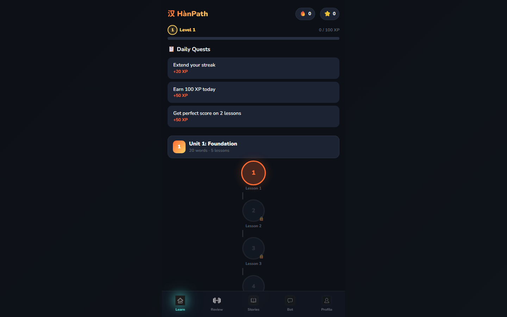

  
  <h1>汉路 HànPath</h1>
  
  
<strong>A Duolingo-inspired Chinese learning platform with structured HSK content, adaptive review, and AI-powered support.</strong>

  

    <a href="https://han-path.vercel.app">🚀 View Live App</a> •
    <a href="#-getting-started">💻 Getting Started</a> •
    <a href="#-architecture--tech-stack">🏗️ Architecture</a> 
  

 

  

## 🌟 What is HànPath?

**HànPath** helps learners build real reading and listening confidence in Mandarin Chinese. Designed with offline resilience and real-time cloud sync, it combines a structured curriculum with a gamified, habit-building ecosystem.

**Current Scope:** Covers **HSK 1-2** fundamentals, with HSK 3-5 planned on the roadmap.

---

## ✨ Features

- 📚 **Structured Learning Path:** HSK 1-2 curriculum with graded exercises and stories.
- 🧩 **Mixed Exercise Engine:** Drill variations including reading, listening, pinyin, composition, and sentence-building.
- 📖 **Story Mode:** Segmented, graded reading with AI-powered comprehension support.
- 🤖 **AI Chat & Explanations:** Powered by an intelligent OpenRouter integration that auto-routes to reliable free models.
- 🏆 **Gamification Engine:** XP, daily streaks, customizable goals, and achievements.
- ☁️ **Seamless Cloud Sync:** Supabase-backed progress using zero-friction anonymous auth with transparent row-level security.
- 📶 **Offline Resilience:** Local-first browser persistence so your practice never halts due to poor network conditions.

---

## 🛠️ Architecture & Tech Stack

HànPath is engineered as a robust, client-heavy React application focusing on near-zero latency for users. 

**Stack:** React 19 • TypeScript • Vite 8 • Supabase • OpenRouter API • Web Speech & Audio APIs

### Core Systems

* 🧠 **Application Orchestration**
  Built as a React SPA with a unified, in-memory UserStats state. Local persistence writes are triggered reactively to keep the UI blisteringly fast.
* 🏃 **Exercise Runtime Engine**
  Lessons compile into explicitly typed exercise definitions (Exercise, ExerciseType) managed by a singular, highly extensible runner. It instantly handles multiple validation formats (MCQ, string match, token match).
* 📡 **AI Request Pipeline**
  Implements a dedicated OpenRouter network client. It features a free-tier candidate chain with **auto-discovery and fallback retries**—meaning if an AI model goes offline, the app dynamically routes to the next available and caches the success path.
* 🔄 **Progress Sync & Auth**
  Offline readiness is achieved through local-first persistence. The app reconciles with Supabase using stateless anonymous sessions (uth.uid()) and debounced upserts. Data stays rigorously partitioned via Postgres Row Level Security (RLS).
* 🎵 **Audio & UX Reliability**
  Native **Web Speech API (TTS)** and **Web Audio API (SFX)** synthesize sounds cleanly without bloated media dependencies. Complex overlapping triggers are managed through exact audio-guard locks.

<b>🤔 Technical Design Decisions (Expand to read)</b>

 

- **Local-first + Cloud Sync:** Ensuring interactions feel immediate is critical in a learning app. State writes locally instantly, deferring Supabase sync to background reconciliation.
- **Anonymous Auth:** Provides low-friction onboarding while still securely sandboxing progress in the cloud (no messy account creation step upfront).
- **OpenRouter Fallback Routing:** Free AI APIs can be unstable. A dynamic priority router maximizes uptime without maintaining paid keys for the app's default demo state.
- **Single Typed Exercise Engine:** Expanding content is vastly cheaper when a single, pure UI runner can ingest a standardized Exercise tree.

---

## 🚀 Getting Started

Follow these steps to run HànPath locally:

### 1. Install & Run
\\\ash
# Install dependencies
npm install

# Start the Vite development server
npm run dev
\\\

### 2. Build for Production
\\\ash
npm run build
npm run preview
\\\

> **Note:** Environment credentials for Supabase and the AI pipeline are directly injected at our deployment platform level (Vercel). You **do not** need local .env keys to run the base UI locally, though cloud sync and AI chats will fallback to mocked or local functionality unless connected.

---

## 🛣️ Roadmap

- **Content Constraints (v1):** Currently capped at HSK 1-2. HSK 3, 4, and 5 exercises and stories will be added in upcoming releases.
- **Ecosystem:** Implementing account linking across devices (upgrading anonymous profiles to OAuth).
- **Analytics:** Expanding simple XP metrics into deep skill diagnostics.
- **Production Hardening:** Migrating client-side AI API calls behind a secure backend proxy to prevent key exposure.

---

## 📄 License

This project is licensed under the **MIT License**.