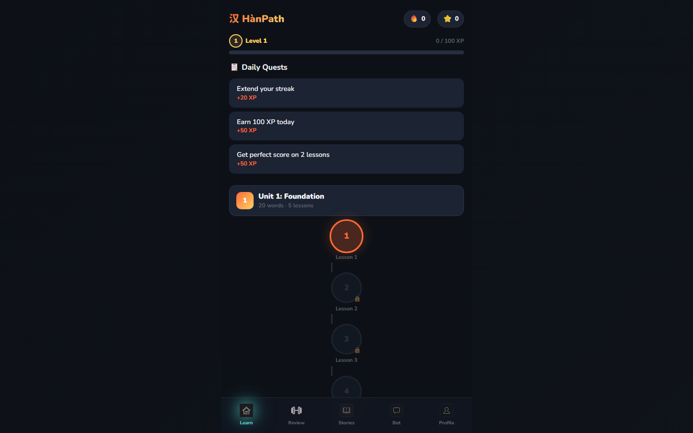

<div align="center">
  
  <h1>汉路 HànPath</h1>
  
  <p><strong>A Duolingo-inspired Chinese learning platform with structured HSK content, adaptive review, and AI-powered support.</strong></p>

  <p>
    <a href="https://han-path.vercel.app">🚀 View Live App</a> •
    <a href="#-getting-started">💻 Getting Started</a> •
    <a href="#-architecture--tech-stack">🏗️ Architecture</a> 
  </p>
</div>

<br />

<div align="center">
  <a href="https://han-path.vercel.app">
    
  </a>
</div>

## 🌟 What is HànPath?

**HànPath** helps learners build real reading and listening confidence in Mandarin Chinese. Designed with offline resilience and real-time cloud sync, it combines a structured curriculum with a gamified, habit-building ecosystem.

**Current Scope:** Covers **HSK 1-2** fundamentals, with additional HSK material present in the data layer but not yet presented as a complete production curriculum.

---

## ✨ Features

- 📚 **Structured Learning Path:** HSK 1-2 curriculum with graded exercises and stories.
- 🧩 **Mixed Exercise Engine:** Drill variations including reading, listening, pinyin, composition, and sentence-building.
- 📖 **Story Mode:** Segmented, graded reading with AI-powered comprehension support.
- 🤖 **AI Chat & Explanations:** Powered by an intelligent OpenRouter integration that auto-routes to reliable free models.
- 🏆 **Gamification Engine:** XP, daily streaks, customizable goals, and achievements.
- ☁️ **Seamless Cloud Sync:** Supabase-backed progress using zero-friction anonymous auth with transparent row-level security.
- 📶 **Offline Resilience:** Local-first browser persistence so your practice never halts due to poor network conditions.

---

## 🛠️ Architecture & Tech Stack

HànPath is a client-heavy React application. Common exercise interactions update local state immediately; cloud synchronisation and AI requests are separate network operations.

**Stack:** React 19 • TypeScript • Vite 8 • Supabase • OpenRouter API • Web Speech & Audio APIs

### Core Systems

* 🧠 **Application Orchestration**
  Built as a React SPA with a unified Zustand `UserStats` store. Zustand persistence keeps progress in the browser, while the app separately reconciles that state to Supabase when anonymous authentication is available.
* 🏃 **Exercise Runtime Engine**
  Lessons compile into explicitly typed exercise definitions (Exercise, ExerciseType) managed by a singular, highly extensible runner. It instantly handles multiple validation formats (MCQ, string match, token match).
* 📡 **AI Request Pipeline**
  The browser calls a server-side `/api/chat` proxy. Vercel uses `api/chat.ts`; the Docker image uses the same validation and safety contract in `server/chat-proxy.mjs`. Both keep the OpenRouter credential server-side, rate-limit callers, validate the request shape, and forward only supported model/message options. The browser client tries a small ordered list of free model IDs when an upstream request fails.
* 🔄 **Progress Sync & Auth**
  Offline readiness is achieved through local-first persistence. The app uses Supabase anonymous sessions and debounced upserts when configured. Local and cloud snapshots carry an `updated_at` value: a strictly newer local snapshot wins, a newer cloud snapshot hydrates the device, and ties converge to cloud. `user_progress` is protected by Postgres Row Level Security, while the public leaderboard exposes only explicit XP/level aggregates rather than the private JSONB progress document.
* 🎵 **Audio & UX Reliability**
  Native **Web Speech API (TTS)** and **Web Audio API (SFX)** synthesize sounds cleanly without bloated media dependencies. Complex overlapping triggers are managed through exact audio-guard locks.

<details>
<summary><b>🤔 Technical Design Decisions (Expand to read)</b></summary>
<br/>

- **Local-first + Cloud Sync:** Ensuring interactions feel immediate is critical in a learning app. State writes locally instantly, deferring Supabase sync to background reconciliation.
- **Anonymous Auth:** Provides low-friction onboarding while still securely sandboxing progress in the cloud (no messy account creation step upfront).
- **OpenRouter Fallback Routing:** Free AI APIs can be unstable. A dynamic priority router maximizes uptime without maintaining paid keys for the app's default demo state.
- **Single Typed Exercise Engine:** Expanding content is vastly cheaper when a single, pure UI runner can ingest a standardized Exercise tree.
</details>

---

## 🚀 Getting Started

Follow these steps to run HànPath locally:

### 1. Install & Run
```bash
# Install dependencies
npm install

# Start the Vite development server
npm run dev
```

### 2. Build for Production
```bash
npm run build
npm run preview
```

### Tests and quality checks

```bash
npm test -- --run       # application and data-generation tests
npm run test:api        # Vercel chat-proxy boundary tests
npm run lint
```

The checked-in suite currently contains 15 Vitest tests plus 3 explicit proxy tests. The story-generation test uses the script's intentional six-second inter-batch throttle, so it has a longer per-test timeout.

> **Note:** Environment credentials for Supabase and the AI pipeline are directly injected at our deployment platform level (Vercel). You **do not** need local .env keys to run the base UI locally, though cloud sync and AI chats will fallback to mocked or local functionality unless connected.

### Docker deployment

The production container serves the Vite SPA and the `/api/chat` proxy from one Node 20 process. Set `OPENROUTER_API_KEY` only at container runtime; never use a `VITE_` variable for this secret.

```bash
docker build -t hanpath .
docker run --rm -p 8080:8080 -e OPENROUTER_API_KEY=sk-or-v1-your-key hanpath
```

The health check is available at `http://localhost:8080/healthz`. This topology keeps the AI key private and makes Docker deployments function without relying on a separate Vercel function.

---

## 🏗️ Request and data flow

```text
React UI
  ├─ exercise runner -> Zustand/localStorage
  ├─ /api/chat -> Vercel function -> OpenRouter (server-side key)
  └─ Supabase anonymous session -> user_progress (RLS-protected)
```

The exercise runner is deliberately shared across lesson and review flows: typed `Exercise` values select the interaction, and the runner owns answer checking, feedback, word-level results, and completion callbacks. This keeps validation rules in one testable component instead of duplicating them in each page.

## 🛣️ Roadmap

- **Content Constraints (v1):** Currently capped at HSK 1-2. HSK 3, 4, and 5 exercises and stories will be added in upcoming releases.
- **Ecosystem:** Implementing account linking across devices (upgrading anonymous profiles to OAuth).
- **Analytics:** Expanding simple XP metrics into deep skill diagnostics.
- **Production Hardening:** Add platform-level rate limiting and monitoring around the server-side `/api/chat` proxy; an application-level per-client limit is already enforced.

---

## 📄 License

This project is licensed under the **MIT License**. See [LICENSE](LICENSE).
