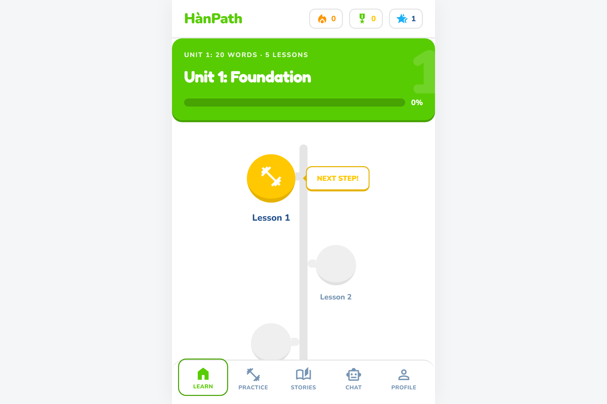

# HanPath

HanPath is a Chinese-learning app with vocabulary lessons, spaced repetition, graded stories, and an AI tutor. Learning progress is stored in the browser, with JSON export and restore for moving it between devices.

[Try the app](https://han-path.vercel.app) · [Local setup](#local-setup) · [Curriculum sources](#curriculum-sources)



## Learning flow

Work through a vocabulary lesson, practise words due for review, and read a story with pinyin and word definitions. Stroke-order practice and pronunciation audio support character learning. The tutor provides an optional place to ask language questions.

## How it works

The frontend uses React, TypeScript, Vite, and Zustand. A service worker caches the app and curriculum assets for offline use. The optional tutor calls a serverless API that keeps provider credentials on the server.

Two implementation choices shape the app:

- **Progress belongs to the browser.** A versioned, validated snapshot stores learning state. Storage failures are surfaced in the profile, and imported progress is previewed before it replaces local data.
- **Tutor requests are controlled on the server.** Signed guest cookies identify anonymous sessions, PostgreSQL-backed quotas limit use, and the API bounds request sizes and checks origins. Model fallback shares a 15-second deadline. Production quota-storage failures return an error rather than bypassing the quota.

See the [progress store](src/store/useStore.ts) and [API implementation](api) for the code. Tests cover storage, API behavior, accessibility, and browser journeys.

## Local setup

Use Node.js 24.x, matching `package.json`, and npm.

```bash
git clone https://github.com/AnasBabari/HanPath.git
cd HanPath
npm ci
npm run dev
```

Open the local URL printed by Vite. This starts the learning frontend; Vite does not run the serverless functions in `api/`.

### Optional tutor configuration

The hosted tutor needs these server-side environment variables, also listed in [.env.example](.env.example):

| Variable | Purpose |
| --- | --- |
| `OPENROUTER_API_KEY` | Model-provider access |
| `SUPABASE_URL` | Quota database endpoint |
| `SUPABASE_SERVICE_ROLE_KEY` | Server-side database access |
| `GUEST_COOKIE_SECRET` | Secret used to sign guest identities |
| `APP_ORIGIN` | Allowed app origin, when explicitly configured |

The quota database also needs the [repository migrations](supabase/migrations). Keep these credentials on the server. Running the tutor locally requires a serverless-function runtime in addition to Vite; the frontend commands above do not configure it.

## Curriculum sources

The vocabulary is community-curated and aligned with HSK 3.0. It is not an official CTI/CLEC publication or certification.

The normalized source is [`drkameleon/complete-hsk-vocabulary`](https://github.com/drkameleon/complete-hsk-vocabulary) release v1.4, pinned to commit `7ac65bf1a6387d35f1ade478906172a19311c7f9`, with HanPath definitions and overrides. The curriculum contains 506 level-1 entries and 750 level-2 entries, plus eight graded stories per level. Build-time checks validate the generated story data.

## Limitations

- Clearing browser storage can remove learning progress. Export a snapshot before moving devices or clearing site data.
- Offline caching does not make the AI tutor available offline; it requires the server and model provider.
- Tutor responses can be incorrect. The curriculum alignment does not imply official endorsement.

## Checks

```bash
npm run check          # Story data, lint, types, unit tests, and production build
npm run test:api       # Serverless API tests
npm run test:a11y      # Automated accessibility checks
npm run test:coverage  # Coverage report
npm run test:e2e       # Playwright browser journeys; requires browser installation
npm run check:bundle   # Audit the built initial JavaScript against the 130 KB gzip budget
```

## License

[MIT](LICENSE)
